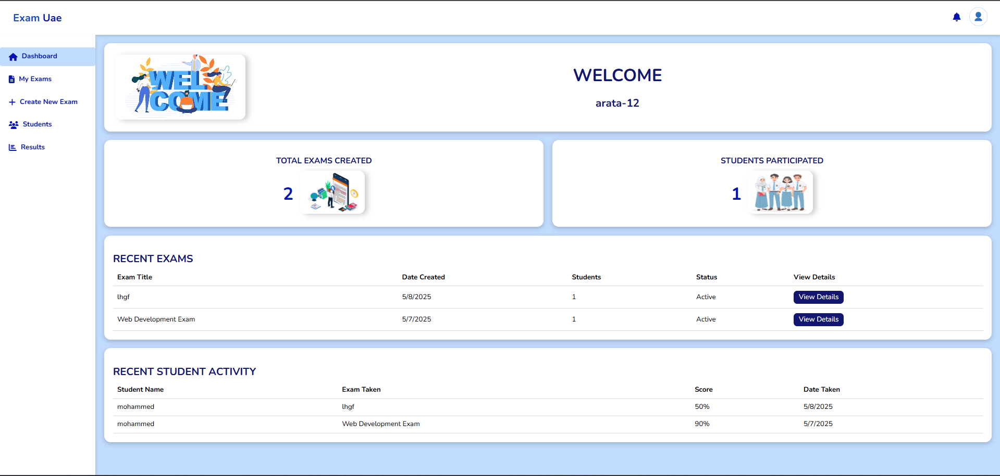

# Online Exam Platform

A full-stack web application for creating, managing, and taking exams online with role-based access (Teachers/Students).



## Features

### Teacher Role
- Create/manage exams with multiple question types( QCM & direct)
- Track student results
- Manage exam by crud system
- Secure authentication with JWT and role-based access

### Student Role
- Take timed exams with real-time validation
- View exam results and historical performance
- Manage profile and progress tracking

### Technical Highlights
- MVC architecture with modular codebase
- Rate-limiting and security middleware
- MySql for persistent data storage
- Responsive UI with consistent styling
### Technology used
#### Backend
 Node.js | Express | MySQL | JWT

#### Frontend
Vanilla JS & modern| CSS3 | HTML5

## Installation

1. **Prerequisites**
   - Node.js v16+
   - MySql
   - Git
1.1 **configure .env db**
    - make sure adding the db name as platform_exam and keep port as 3000
2. **Setup**
   ```bash
   git clone https://github.com/Arata-12/online-exam-platform.git
   cd online-exam-platform
   npm install
